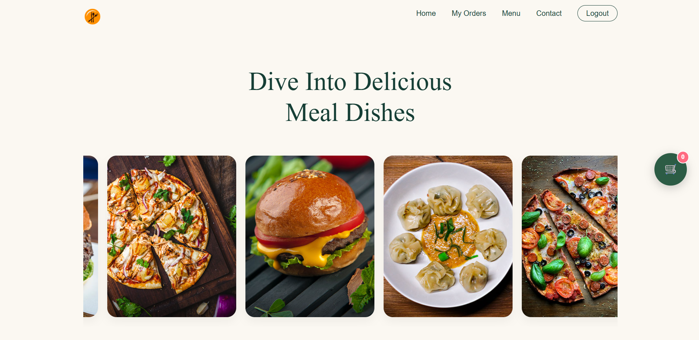
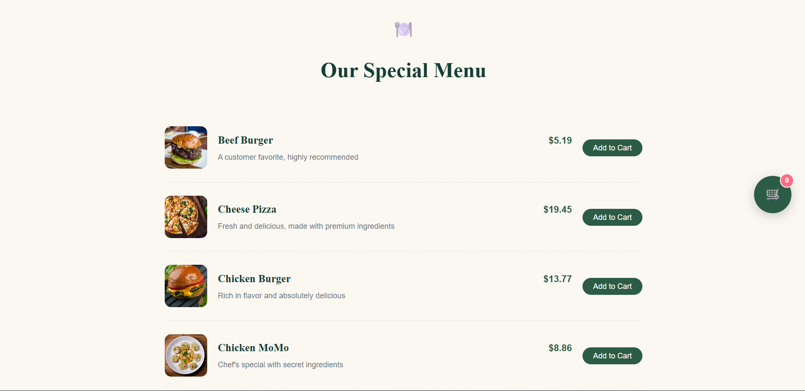
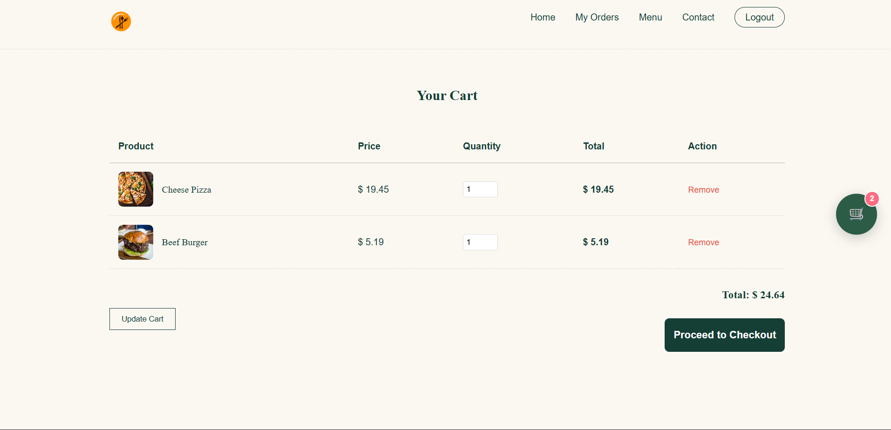
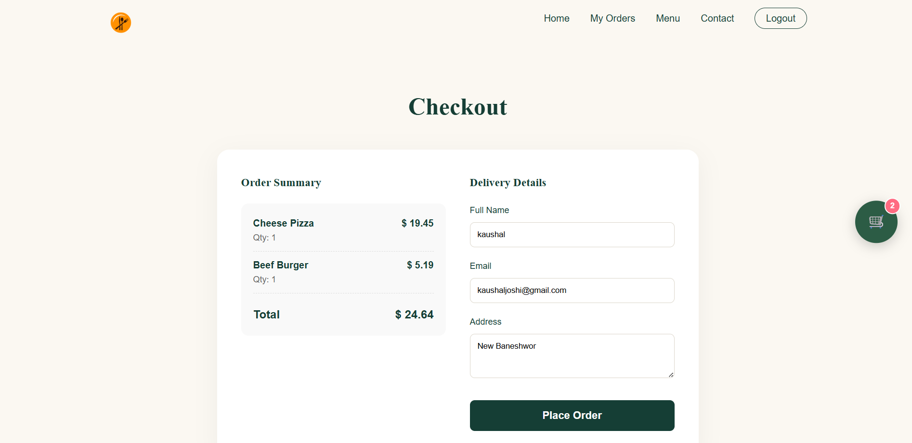
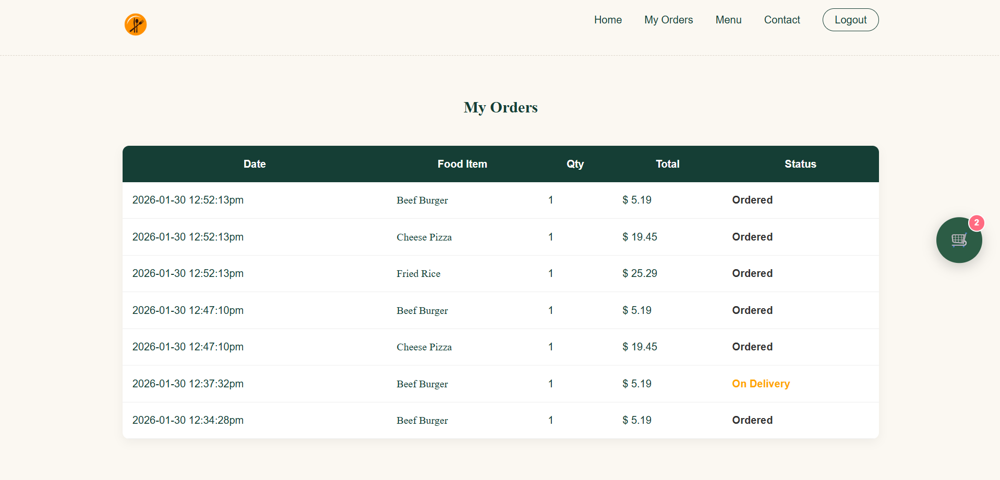
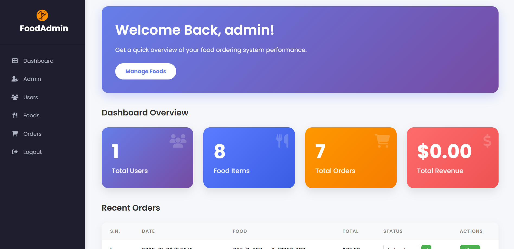

# Online Food Ordering System

A comprehensive web-based food ordering system built with PHP and MongoDB. This project offers a seamless experience for users to order food online and for admins to manage the restaurant operations.

## 🚀 Features

### User Features
- **Modern UI**: Responsive and elegant design with a dynamic food slider.
- **Authentication**: Secure Login, Registration, and Forgot Password functionality.
- **Browse Menu**: View available food items with prices and descriptions directly on the homepage.
- **Cart System**: 
  - Add items to cart.
  - Floating cart button for quick access.
  - Manage cart quantities.
- **Checkout**: Simple checkout process to confirm order details and delivery address.
- **Order History**: Track order status (Ordered, On Delivery, Delivered, Cancelled) in "My Orders".

### Admin Features
- **Dashboard**: Overview of total users, foods, orders, and revenue.
- **Manage Foods**: Add, update, and delete food items (with image upload).
- **Manage Orders**: View recent orders and update order status (Delivered, Cancelled, etc.) directly from the dashboard.

## 🛠️ Technology Stack

- **Frontend**: HTML5, CSS3 (Custom Responsive Styling), JavaScript
- **Backend**: Core PHP
- **Database**: MongoDB (NoSQL)
- **Web Server**: Apache (via XAMPP)

## 📦 Setup and Installation

1.  **Prerequisites**:
    - Install [XAMPP](https://www.apachefriends.org/) (for PHP & Apache).
    - Install [MongoDB Community Server](https://www.mongodb.com/try/download/community).
    - Install the **PHP MongoDB Extension**:
        - Download the `.dll` from PECL.
        - Add `extension=php_mongodb.dll` to your `php.ini` file.

2.  **Installation**:
    - Clone or download this project.
    - Move the project folder to your `htdocs` directory (e.g., `C:\xampp\htdocs\Online_Food_Ordering_System`).

3.  **Database Configuration**:
    - provided on MONGODB_SETUP.txt file.

4.  **Run the Project**:
    - Start Apache and MongoDB.
    - Open your browser and visit: `http://localhost/Online_Food_Ordering_System/`

## 📂 Project Structure

- `admin/`: Admin control panel stats and management logic.
- `config/`: Database connection and constants.
- `CSS/`: Custom styles (`style.css` for main, `style-user.css` for auth pages).
- `images/`: Stores food images and site assets.
- `particle-front/`: Reusable header/menu components.

## 📸 Screenshots

---
**Developed by Kaushal Joshi**
